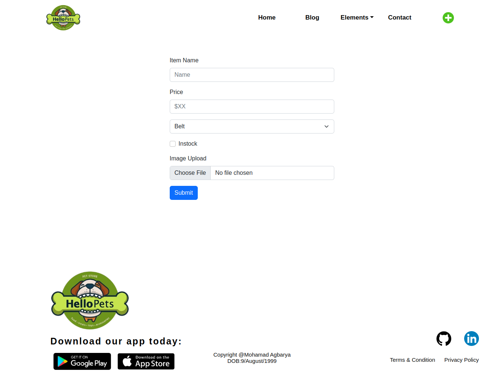
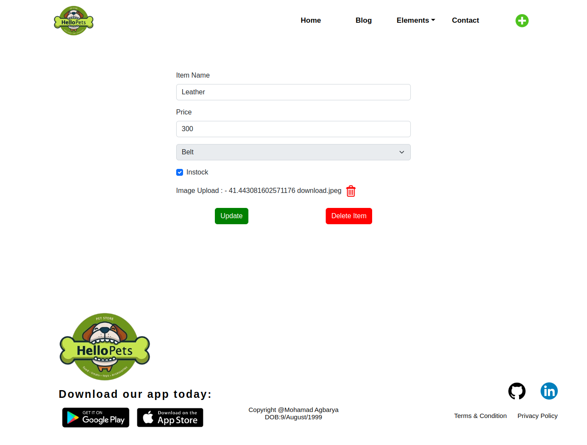
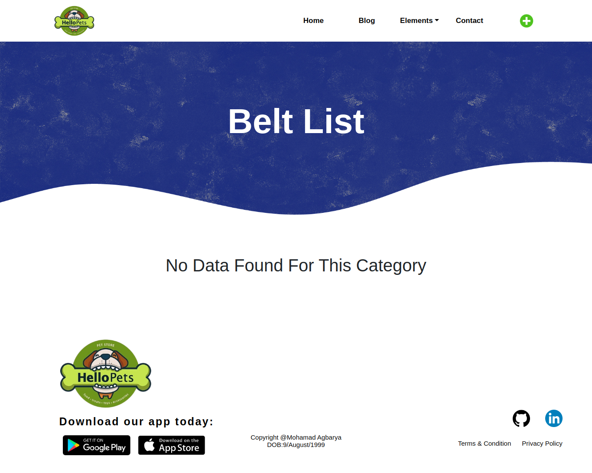

# for start the project:
npm run start

# for creating the build:
npm run build
firebase deploy

# All the credentials of firebase is in
firebase.config.js

# After project start main screen look like

# the add screen look like

# the edit and delete screen looks like

# view all data look like this

